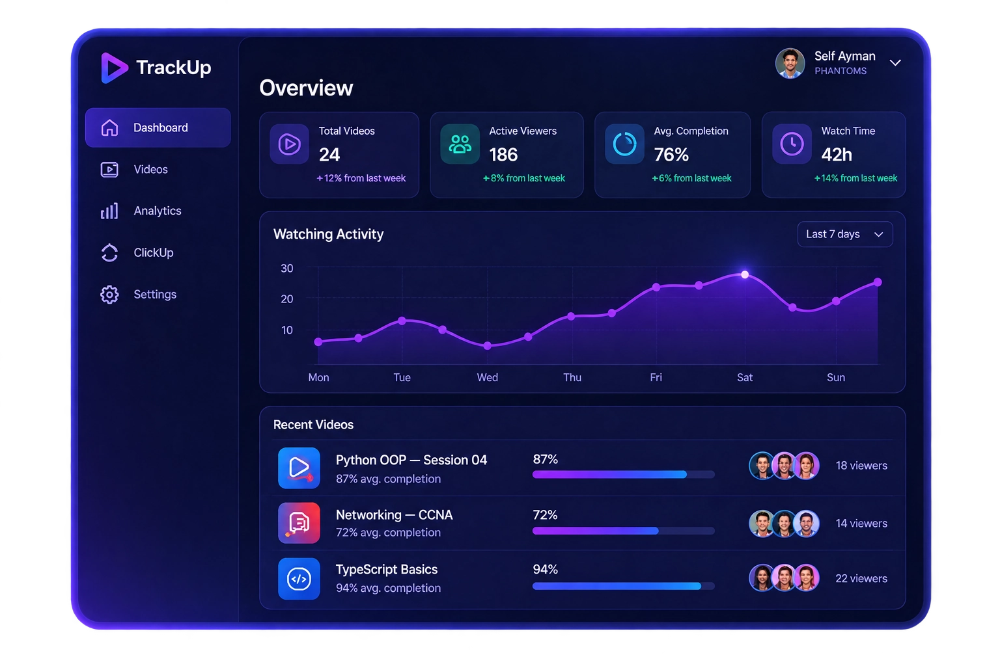
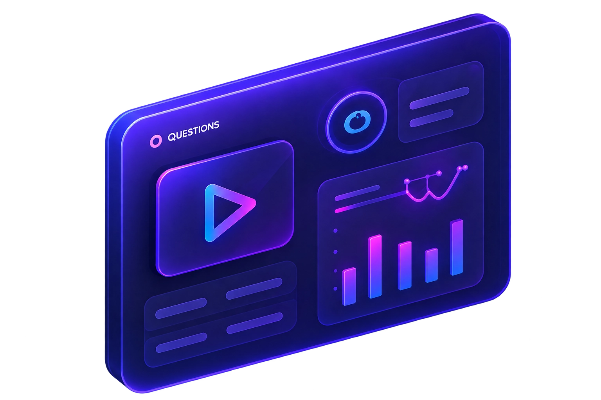
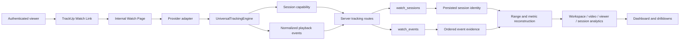
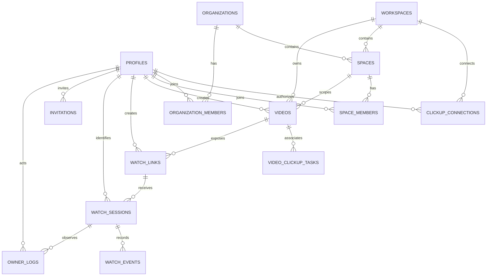

<div align="center">
  
  <h1>TrackUp</h1>
  <p><strong>Private video sharing with evidence-backed viewer activity analytics.</strong></p>
  <p>
    <a href="https://github.com/TheSeifDev/traking"></a>
    <a href="https://trakeup.vercel.app"></a>
    <a href="https://github.com/TheSeifDev/traking/actions/workflows/quality.yml"></a>
    
    
    
  </p>
  <p>
    <a href="https://trakeup.vercel.app">Open production</a> ·
    <a href="https://github.com/TheSeifDev/traking">View source</a> ·
    <a href="#local-development">Run locally</a>
  </p>
</div>

<br />

<p align="center">
  
</p>

> **Production status.** TrackUp is deployed to [https://trakeup.vercel.app](https://trakeup.vercel.app). The last application release was production-verified at commit `316cd7bc537914911054a59b779f8a5b8994632e`, with green typecheck, lint, test, build, GitHub Quality, and Vercel deployment gates. The dashboard artwork above is a product illustration with illustrative values; it is not a live analytics screenshot and must not be used as telemetry evidence.

## Contents

- [Product overview](#product-overview)
- [Feature overview](#feature-overview)
- [Tracking architecture](#tracking-architecture)
- [Telemetry model](#telemetry-model)
- [Provider architecture](#provider-architecture)
- [Analytics architecture](#analytics-architecture)
- [Organization and Space architecture](#organization-and-space-architecture)
- [Security architecture](#security-architecture)
- [Database architecture](#database-architecture)
- [Application architecture](#application-architecture)
- [Important routes](#important-routes)
- [API architecture](#api-architecture)
- [Local development](#local-development)
- [Environment variables](#environment-variables)
- [Testing and QA](#testing-and-qa)
- [Production deployment](#production-deployment)
- [Known limitations](#known-limitations)
- [Roadmap](#roadmap)
- [Project status](#project-status)
- [References](#references)

## Product overview

TrackUp is a ClickUp-connected internal video delivery and observability application. A team member adds a video to a scoped TrackUp library, creates a private TrackUp Watch Link, and shares that internal URL with an authenticated viewer. The viewer watches inside TrackUp rather than being redirected to the provider’s public page. When the provider exposes a reliable callback contract, TrackUp records playback telemetry and reconstructs evidence-backed watch activity; when it does not, TrackUp records only the session-level activity it can prove.

The product addresses a common operational problem: a shared video URL can show that a link was opened, but it cannot necessarily show whether a person played the video, how much of it was observed, where a seek occurred, whether playback paused or buffered, or which events belong to which authenticated user. TrackUp separates **access**, **playback evidence**, **identity**, and **scope** so analytics do not imply more precision than the source provider supplies. The provider registry, tracking engine, and analytics services are the implementation sources of truth for those rules [1] [2] [3].

TrackUp is designed for teams that already organize work in ClickUp and need a controlled way to distribute training, onboarding, project updates, reviews, and internal demos. Owners and authorized administrators manage the library, links, members, Spaces, and analytics. Authenticated members use the internal product surface according to their organization and Space access. The current production implementation does not implement anonymous guest tracking as an active authorization path.

<p align="center">
  
</p>

The repository visuals are branding/product illustrations used by the public site. They are included here to communicate the intended visual system, not to represent a live production dataset.

## Feature overview

| Area | What is implemented | Evidence and boundary |
|---|---|---|
| Video library | Scoped video cards with provider, thumbnail where the adapter supports one, link status, sessions/viewers, measured watch time, filters, sorting, details, delete, and link actions. | The library loads saved videos from `/api/videos`; it does not synthesize client-only rows. |
| Video details | Provider information, source URL, persisted watch-link usage, analytics summaries, and scoped management controls. | Link session counters and access timestamps come from persisted sessions and are aligned with the Watch Links directory. |
| Watch Links | One active TrackUp viewer link per video, copy/open actions, revoke, retained revoked history, and protected creation/deletion. | An active-link uniqueness constraint is present in the database; revoked links fail closed. |
| Internal viewer | `/watch/[token]` renders the appropriate provider surface inside TrackUp. | The viewer does not redirect to a public YouTube page. Provider-specific limitations remain visible. |
| Viewer tracking | Authenticated session creation, event batching, lifecycle events, ordered events, idempotency keys, private session capability, and server-trusted session ending. | Session creation is tied to the authenticated TrackUp profile and is opened on actual playback, not page load. |
| Workspace Viewer Activity | Six KPIs, sparklines, date scope, search, status, minimum-session filtering, daily activity, completion distribution, canonical viewer directory, pagination, and CSV export. | Filters recalculate the complete server-side dataset, including KPIs, chart, distribution, and directory. |
| Video Analytics | Video totals, viewers, sessions, event counts, measurable watch time, completion, last position, coverage, and telemetry health. | Metrics are null/unavailable when provider evidence is insufficient. |
| Session Analytics | Detailed session record, first play, last activity, lifecycle timestamps, event count, ordered timeline, raw event expansion, and coverage state. | Full event payloads are retained for dedicated drilldowns, not overview payloads. |
| User 360 | Authorized profile view with organization memberships, Space memberships, watched videos, event counters, session history, progress, and grouped timelines. | Data is constrained to the caller’s authorized Organization/Space scope. |
| Organization and Spaces | Organization directory, Organization Members, real Spaces, Space Members, context switching, sync surfaces, and virtual All Spaces. | All Spaces is a virtual Organization scope, never a fake Space UUID. |
| Member management | Organization member add/update/remove and Space member add/update/remove with role/status protections. | Candidates for Space membership must already be active Organization members. |
| ClickUp integration | OAuth sign-in, authorized Workspace discovery, ClickUp identity provisioning, connection persistence, Workspace/Space sync, and ClickUp task lookup/association. | ClickUp OAuth state, callback URI, token exchange, and server-only credentials are handled in protected server code. |
| Exporting | Scoped Workspace Viewer Activity CSV export with current search/status/minimum-session/date filters. | The export is authorized server-side and contains calculated aggregate viewer rows, not raw event dumps or tokens. |

## Tracking architecture

TrackUp uses a provider-neutral tracking pipeline. Provider adapters translate native callbacks into normalized playback events; the shared tracking engine owns session semantics, watch-time clocking, event vocabulary, completion signaling, and end-of-session behavior. The browser emits only from the internal viewer, and the server authorizes every persistence operation.



### End-to-end lifecycle

1. An authenticated user opens a valid TrackUp Watch Link. The server resolves the opaque token, checks revocation and expiry, resolves the linked video, and verifies the target Space relationship.
2. The internal Watch Page loads the provider adapter. Player readiness and metadata loading are not treated as a view. The provider must report an actual play or resume transition before the shared engine requests a tracking session.
3. The server creates a `watch_sessions` row bound to the authenticated TrackUp profile. It stores a one-way viewer identifier, client metadata derived from the user agent, a private session capability, and a server-written `session_started` lifecycle event. The browser does not submit authoritative viewer name or email.
4. Provider callbacks are normalized into the shared event vocabulary. Events carry the session identity, current position, optional provider duration, optional seek origin, client retry key, sequence number, provider occurrence time, playback-rate fields, and bounded metadata.
5. The browser batches events and posts them to `/api/tracking/event`. The server validates the payload, rechecks session capability and profile identity, enforces the session’s Space authorization, normalizes numeric fields, limits metadata, and upserts retry-safe event rows.
6. The engine clocks only active playback. Pauses, seeks, and buffering stop the active clock. A progress discontinuity can produce an inferred seek event, but a seek never marks the skipped interval as watched.
7. Natural end, page leave, or an explicit close sends the end-session request. The server writes final lifecycle events, reloads persisted events, reconstructs the evidence-backed ranges, and derives final watch time and completion. Client-reported final metrics cannot create measured values.
8. Analytics services join sessions through `watch_link_id → video_id` and, where available, `viewer_profile_id → profiles`. Dedicated drilldown routes retain ordered event arrays; overview callers can request a bounded projection that keeps event counts and the latest event type while omitting raw event payloads.

### Identity and trust boundaries

The active tracking identity is the authenticated profile ID resolved from the signed `trackup_user` cookie and revalidated against the `profiles` table. The server stores a stable one-way hash in `viewer_identifier` for compatibility and joins canonical viewer data through `viewer_profile_id`. Browser-supplied names, emails, roles, organization IDs, Space IDs, and arbitrary session metrics are not accepted as authority. The private `session_token` is required for event and end-session writes and is checked against the intended session and profile.

The route layer intentionally returns a generic `session_not_found`-style failure for invalid or unauthorized session capability cases. This prevents the caller from using tracking endpoints as an existence oracle. Link revocation and expiry are checked when resolving a link and again immediately before session creation to reduce resolve-then-insert races [4] [5].

### Ordering, retries, and lifecycle safety

The client can provide a `client_event_id`, `sequence_number`, and `occurred_at` value. The event schema includes a unique session/client-event identity and indexes for session sequence, occurrence time, receipt time, and event type. Upserts with `ignoreDuplicates` make a retried event safe when the same client key is reused. Server receipt timestamps remain available separately from provider occurrence timestamps.

The engine emits `play` for the first actual playback transition and `resume` for later play transitions in the same engine lifecycle. It emits `complete` at the provider-reported 95% position threshold when duration is available, while final analytics still apply their own evidence and measured-state rules. Ending a session resets the engine state so a subsequent playback can create a new session rather than silently appending to a closed one.

### Watched ranges and coverage

`src/lib/analytics/ranges.ts` is the canonical range reconstruction implementation. It uses defensible position/duration evidence from detailed-capable providers, merges overlapping watched intervals, and calculates unique coverage without treating a seek target as watched. A range visualization is therefore evidence-based rather than a decorative heatmap. If the event series lacks reliable position/duration data, or the provider is session-only, TrackUp returns an explicit unavailable state rather than a fabricated range.

## Telemetry model

The persisted event vocabulary is defined in `src/types/tracking.ts` and mirrored by the video analytics types. The following table describes the implemented normalized events. Provider adapters emit only events that they can observe; the server-created session lifecycle events are separate from provider playback precision.

| Event family | Normalized events | Meaning in TrackUp |
|---|---|---|
| Session/player lifecycle | `session_started`, `player_ready`, `metadata_loaded`, `session_ended` | Server-created session boundary and provider/player readiness state. Readiness alone is not a view. |
| Playback | `play`, `resume`, `pause`, `ended`, `complete` | Actual playback transitions, natural end, and evidence-backed completion signal. |
| Position/progress | `heartbeat`, `playback_progress` | Periodic position samples. The engine uses bounded sampling and may infer a seek from a large discontinuity. |
| Seeking | `seek`, `seek_started`, `seek_completed` | Provider-reported seek lifecycle, including `from_position` and bounded seek metadata where available. |
| Buffering | `buffer`, `buffering_started`, `buffering_ended` | Buffer lifecycle when the provider exposes it. Buffering pauses the active watch-time clock. |
| Rate | `rate_change`, `playback_rate_changed` | Playback-speed change and optional previous/new rate values. |
| Audio/control | `volume_changed`, `mute_changed`, `fullscreen_entered`, `fullscreen_exited` | User/player control state when observable through the adapter. |
| Visibility | `visibility_change`, `visibility_hidden`, `visibility_visible` | Document/player visibility changes observed by the viewer surface. |
| Quality | `quality_changed` | Provider quality changes when exposed. |
| Errors | `player_error` | Provider error with bounded code/context; it does not become a fabricated playback metric. |

### Event fields and metadata

A tracking event contains `session_id`, the private `session_token`, `event_type`, a non-negative `position`, optional positive `duration`, optional `from_position`, optional `client_event_id`, optional `sequence_number`, optional `occurred_at`, optional playback-rate fields, and bounded key/value metadata. Metadata is intended for non-PII context such as provider state, player state, sampling interval, seek delta, visibility, buffering state, quality, device, browser, operating system, or a provider error code. The server rejects malformed event types, invalid numeric values, oversized or unsafe identifiers, and out-of-range fields before persistence.

The server-created `session_started` event can include a privacy-preserving `referrer_origin`. Only the parsed origin is retained; query strings, paths, and tokens are not stored. Request user-agent parsing produces coarse device, browser, and operating-system labels for authorized analytics.

### Availability states

TrackUp deliberately separates a real zero from an unavailable measurement. The analytics model uses `measured`, `missing`, and `unsupported` telemetry states, while heatmaps use `measured`, `no_telemetry`, `insufficient_data`, and `not_available_from_provider` availability values.

| State | Meaning | UI expectation |
|---|---|---|
| Measured | The provider and persisted event evidence support the requested metric. | Display the calculated value and identify the measurement scope. |
| Missing | The provider could support detail, but the session lacks enough persisted telemetry. | Display `Unavailable`, `Not measured`, or an equivalent explicit state. |
| Unsupported | The provider is session-only or does not expose the requested signal. | Do not display a fake zero; explain that the metric is unavailable from the provider. |
| Insufficient data | Some telemetry exists, but it cannot defensibly reconstruct a range or metric. | Keep coverage/range output unavailable rather than extrapolating. |
| Session-only | Access/session activity is persisted, but provider playback position and duration are not reliable. | Session counts and timestamps may be shown; watch time, completion, progress, and coverage remain unavailable. |

## Provider architecture

Provider behavior is centralized in `src/lib/playback/providers.ts`. Each `ProviderAdapter` declares a source type, label, playback kind, capability set, analytics scope, embed URL builder, and thumbnail builder. The Watch Page uses the adapter to choose native HTML5, a provider SDK, or a session-only embed; the shared analytics service consumes normalized events and does not need provider-specific branching for every metric.

### Capability matrix

| Provider | Playback | Detailed telemetry | Position | Duration | Lifecycle events | Seek / buffering | Completion | Watched ranges / heatmap | Current production limitation |
|---|---:|---:|---:|---:|---:|---:|---:|---:|---|
| YouTube | Yes | Yes, when valid IFrame callbacks persist | Yes | Yes | Yes | Yes | Yes, when evidenced | Yes, when evidence is sufficient | Fresh playback in the available production browser was blocked by external Error 153 even though TrackUp emitted the expected API/origin/referrer configuration. Historical persisted YouTube telemetry remains valid for analytics. |
| Vimeo | Yes | Yes, when valid Player SDK callbacks persist | Yes | Yes | Yes | Yes | Yes, when evidenced | Yes, when evidence is sufficient | Adapter is implemented; live production playback was not independently verified in the final QA pass. |
| Direct media URL | Yes | Yes, through native HTML5 media events | Yes | Yes | Yes | Yes | Yes, when evidenced | Yes, when evidence is sufficient | The source URL must expose a browser-playable media resource and reliable native callbacks. |
| Google Drive | Yes, through an embedded preview | No | No | No | Session lifecycle only | No | No | Session-only by design; the embedded preview does not provide a reliable TrackUp playback callback contract. |
| Telegram | Yes, through the stored embed/source URL | No | No | No | Session lifecycle only | No | No | Session-only by design; unsupported playback precision remains unavailable. |

The matrix describes the application contract, not a promise that every external player will load in every browser or account context. A provider can be playback-capable while still failing to load because of an external policy, embed restriction, or provider error. TrackUp records that error and keeps unsupported metrics unavailable.

### Adding a future provider

A future adapter should implement the existing `ProviderAdapter` contract, declare its true `ProviderCapabilities`, choose an existing or newly justified `PlaybackMetricsScope`, build its safe embed/thumbnail URLs, and translate native callbacks into `NormalizedPlaybackEvent` values. The `UniversalTrackingEngine` should remain the semantic boundary for session start, active watch time, progress sampling, completion, and session end. Analytics should consume persisted normalized events and capability state rather than import a provider SDK directly.

## Analytics architecture

Analytics is split into overview, activity, viewer, video, and session surfaces. The service layer in `src/lib/videos/service.ts` is responsible for scope validation, bounded database reads, identity joining, event normalization, metric derivation, heatmap aggregation, filtering, and pagination. UI components render the returned contracts and do not invent fallback telemetry.

### Workspace overview

The Workspace overview reports library and activity totals such as total videos, total views/sessions, unique viewers, measurable watch time, average watch time, average completion, completion rate, activity over time, top videos, recent activity, and telemetry health. The legacy summary route and dashboard overview can request a projection that omits raw playback-event arrays while retaining event counts and the latest event type for recent-activity labels. Full event arrays are reserved for explicit detail consumers.

### Workspace Viewer Activity Command Center

`/analytics` provides the dense workspace command center. It supports Organization/Space scope, a virtual All Spaces context, date periods, search, measured/unmeasured status, minimum sessions, Clear, daily sessions/unique viewers, measured-session completion distribution, a canonical viewer directory, pagination, and an authorized CSV export.

The six KPI cards are:

| KPI | Evidence rule |
|---|---|
| Unique viewers | Count of canonical profile IDs, then stable persisted viewer identifiers, with a session fallback only when no identity is available. |
| Sessions | Persisted sessions in the active scope and date/filter set. |
| Measured watch time | Sum of evidence-backed watch time only for measured sessions. |
| Average watch time | Average of measured-session watch time, never session-only duration. |
| Average completion | Average of measured completion values only. |
| 90%+ completion rate | Percentage of measured sessions whose evidence-backed completion reaches at least 90%. |

Every search/status/minimum-session/date filter is applied before metrics, chart points, completion distribution, and directory pagination are built. Comparison cards use a previous period only when a meaningful comparison can be calculated; otherwise the UI states that no defensible previous-period comparison is available.

### Viewer directory and profile

The directory groups sessions by canonical identity. The preferred key is `viewer_profile_id`, followed by the persisted one-way viewer identifier; records with different stable legacy identifiers are not merged because their display names happen to match. A directory row exposes session count, measured-session count, measured progress, watch time, last activity, videos watched, device metadata, and telemetry state. The visible progress definition is **average measured completion across this viewer’s measured sessions**.

A viewer row opens `/analytics/viewers/[viewerId]`. The viewer profile combines the authorized viewer identity with independent video rows and session history. It shows organization and Space memberships when visible in the caller’s scope, watched videos, watch time, duration, sessions, completion, last position, event counters, rates, buffering, visibility, coverage, and grouped timelines. Unsupported values remain explicit `Unavailable` or `Not available from provider` states.

### Viewer plus video analytics

`/analytics/videos/[id]/viewers/[viewerId]` is the viewer-video surface. It aggregates one viewer’s sessions for one video and returns total sessions, measured sessions, session-only sessions, measurable watch time, unique coverage, average/best completion, last position, first/last watched timestamps, total event counts by type, rewatch count, watched ranges, heatmap state, telemetry state, and the underlying sessions.

### Video analytics

`/analytics/videos/[id]` is video-specific rather than workspace-wide. It reports views/sessions, unique viewers, provider measurement scope, measurable watch time, average watch time, average completion, 90%+ completion rate, defensible drop-off point, latest activity, viewer sessions, viewer summaries, heatmap state, and measured/missing/unsupported session health.

The video analytics UI is backed by real rows joined through the video’s Watch Links and sessions. The final QA repair ensured that Video Details and Watch Links use the same persisted session source for active-link usage counters and first/last access timestamps.

### Session analytics and timelines

`/analytics/videos/[id]/sessions/[sessionId]` is the event-level detail surface. It verifies the session against the video, scope, and authorized viewer relationship, then presents session timestamps, first play, last activity, ended state, watch time, completion, last position, provider scope, device metadata, event count, coverage state, and the ordered event timeline. Raw event details can be expanded on this dedicated route; overview endpoints intentionally avoid sending the full raw event array when the UI does not need it.

### Metric evidence rules

Watch time is not calculated from page-open time or a client-reported final number. The server derives final session metrics from persisted events, provider capability, duration evidence, and reconstructed ranges. Completion reflects evidence-backed position relative to a known duration. Coverage sums merged unique ranges rather than double-counting rewatched intervals. Session-only providers may contribute sessions, timestamps, identity, and provider errors, but not fabricated position, duration, completion, progress, or heatmap values.

The current service reads bounded session/event windows for workspace and drilldown analytics. The workspace overview projection reduces browser payload size by omitting raw event arrays, but it does not yet replace all server-side shaping with a database-side rollup. The explicit operational bound is documented in [Known limitations](#known-limitations).

### Exporting the current scope

`GET /api/analytics/viewer-activity/export` produces a calculated CSV for the authorized active Organization or Space scope. It accepts the active date period and viewer-activity filters, including search, telemetry status, and minimum sessions. The route resolves authentication and scope again on the server and returns viewer rows derived by the same analytics service used by the dashboard. It does not return raw playback events, session capability tokens, Watch Link tokens, ClickUp access tokens, or data outside the requested scope.

## Organization and Space architecture

TrackUp has two related but distinct tenancy layers. An **Organization** is the top-level tenant boundary associated with a ClickUp Workspace relationship. A **Space** is a real child context with its own membership and resource scope. Videos are assigned to a Space and retain their original Workspace relationship. The additive migrations preserve existing resource IDs and backfill deterministic Organization/Space relationships rather than rewriting historical tracking data [6] [7].

### All Spaces is virtual

> **Invariant:** `All Spaces` is an HTTP-only preference represented as `all:<organization-uuid>`. It is a virtual Organization data scope, never a row in `spaces`, never a ClickUp Space, never `space_id=all`, and never a fake UUID.

When an Owner selects All Spaces, the server authorizes the selected Organization and linked ClickUp Workspace, then reads every organization-owned resource, including preserved historical Organization-container rows where the application contract requires them. Normal child-Space presentation still excludes legacy container rows. A real Space context always uses its actual UUID and is checked against the selected Organization before reading or mutating resources.

### Roles and memberships

The repository contains both global profile roles and scoped membership roles. They must not be conflated:

| Layer | Values | Meaning |
|---|---|---|
| TrackUp profile role | `owner`, `admin`, `viewer` | Global RBAC hierarchy used by platform-level permissions and protected route guards. |
| Organization membership | `admin`, `member` with `active`, `suspended`, or `removed` status | Access and management relationship inside one Organization. |
| Space membership | `admin`, `member` with `active`, `suspended`, or `removed` status | Access and management relationship inside one real Space. |

An Owner has the platform-wide owner role and authorized Organization/Space access. An Admin can perform the admin-level operations allowed by the current profile and scoped membership. A Member is the least-privilege Organization/Space membership role. A Space Admin can manage the Space membership and permitted Space resources. The legacy platform `viewer` role remains distinct from the scoped membership label `member`; UI labels must be interpreted in their layer.

Organization member operations require an authorized Organization admin membership or Owner access. Space member candidates must already be active Organization members, and Space mutations require the appropriate Space authorization. The service protects owner/self changes, last-admin removal/demotion, organization mismatches, inactive profiles, and invalid status transitions.

## Security architecture

TrackUp treats the browser as an untrusted client. Hiding a navigation item is a usability decision, not an authorization decision. Protected pages use server guards; API handlers use authentication, role, permission, and dashboard wrappers; resource services re-check Organization, Space, membership, and parent-resource predicates before service-role queries. The signed cookie identifies a profile, but the server reloads the current database profile and role on every protected request [8] [9].

### Security guarantees implemented

| Boundary | Implementation behavior |
|---|---|
| Authentication | ClickUp OAuth state is validated; code/token exchange and ClickUp identity/workspace responses are checked; a signed HTTP-only `trackup_user` cookie is created after provisioning. |
| Profile resolution | The session cookie supplies an ID only. The active profile, email, role, and status are read from the database. |
| Organization isolation | Organization selectors are resolved against accessible organizations and the linked Workspace. Invalid selectors do not fall back to an unscoped global read. |
| Space isolation | A selected Space must belong to the selected Organization and pass membership/resource authorization. |
| Video and analytics authorization | Video, Watch Link, session, event, and analytics reads are constrained through their parent video/link/session relationships and scope. |
| Watch Links | Tokens are opaque; links are checked for existence, expiry, and revocation; only one active link per video is allowed by the current lifecycle/constraint design. |
| Tracking writes | A private session capability, profile identity, live session state, event validation, and Space authorization are checked before writes. |
| PII handling | Analytics never returns raw session capability tokens, Watch Link tokens, ClickUp access tokens, or service credentials. Viewer identity uses profile joins and one-way identifiers. |
| Event validation | Event types, positions, durations, identifiers, sequence numbers, occurrence timestamps, playback rates, and bounded metadata are validated at the route boundary. |
| IDOR protection | Direct viewer/video/session IDs are not sufficient; server-side scope and parent-resource checks must succeed. |
| Export authorization | CSV export re-resolves the authenticated caller and active Organization/Space scope before calculating rows. |
| Database posture | Supabase RLS is enabled across the protected entities; direct client reads/writes are not the application authorization path. Server-only service-role access is used after explicit checks. |

### Cookies, headers, and CSRF posture

The application uses HTTP-only, bounded-lifetime, `SameSite=Lax` cookies; production session cookies are `Secure`. The OAuth state cookie is short-lived and must match the callback state before token exchange. The application sends a CSP compatible with the implemented YouTube, Vimeo, Google Drive, Telegram, and Supabase connections, plus `strict-origin-when-cross-origin`, `X-Content-Type-Options: nosniff`, `X-Frame-Options: DENY`, and a restrictive Permissions Policy [10].

The current implementation relies on same-origin browser requests plus role/resource authorization for state-changing internal requests. It does **not** currently implement a separate synchronizer CSRF token or an explicit Origin/Referer allowlist. It also does not claim a distributed production rate limiter; no in-memory limiter is presented as production-safe. Those are real hardening limitations, not hidden guarantees.

## Database architecture

The database is PostgreSQL managed through Supabase migrations. The migrations are additive and include RLS, foreign keys, check constraints, uniqueness constraints, timestamps, indexes, lifecycle fields, and security-hardening functions. The core product relationship is:



### Entities

| Entity | Responsibility | Important fields/constraints |
|---|---|---|
| `profiles` | ClickUp-provisioned TrackUp identity and global role | ClickUp user ID, name, email, `owner/admin/viewer` role, active status. |
| `role_change_audit` | Immutable role-change evidence | Target profile, actor, previous/new role, timestamp. |
| `workspaces` | ClickUp Workspace connection root | Unique `clickup_team_id`, name, timestamps. |
| `clickup_connections` | Server-only Workspace access token association | Profile, Workspace, access token, unique profile/Workspace pair; direct client reads denied. |
| `organizations` | Top-level tenant boundary above Spaces | Name, slug, ClickUp Workspace relationship, settings, archive state. |
| `organization_members` | Organization-scoped profile access | Organization/profile uniqueness, admin/member role, active/suspended/removed status. |
| `spaces` | Real child context and resource scope | Name, slug, Organization, optional ClickUp Space relationship, archive state. |
| `space_members` | Space-scoped profile access | Space/profile uniqueness, admin/member role, status, manual/ClickUp source, sync metadata. |
| `videos` | Stored video source and library metadata | Workspace, Space, creator, title, description, provider enum, source URL, optional duration. |
| `video_clickup_tasks` | Video-to-ClickUp task association | Video, ClickUp task ID/name, unique video/task pair. |
| `watch_links` | Opaque share/access capability | Video, unique token, creator, expiry, revocation, created timestamp. |
| `watch_sessions` | Authenticated viewer session lifecycle | Watch Link, profile/one-way identity, device/browser/OS, started/last-seen/ended timestamps, server-derived final metrics, private session token. |
| `watch_events` | Ordered playback and lifecycle evidence | Session, event enum, position/duration, seek origin, client id, sequence, occurred/received timestamps, playback rates, bounded metadata. |
| `invitations` | Pending user/member invitation lifecycle | Inviter/target identity, role/status, expiry/revocation/acceptance state, secure token hash. |
| `viewer_identities` | Historical guest compatibility data | Preserved for legacy compatibility; not the active authorization path for current tracking. |
| `owner_logs` | Owner-visible operational/security evidence | Level, category, actor, resource IDs, metadata, timestamp. |
| `cron_executions` | Scheduled job evidence | Job, start/end, status, error/result metadata. |

The foundational core schema is in [`20260822000003_mvp_core_tables.sql`](./supabase/migrations/20260822000003_mvp_core_tables.sql). Organization and Space hierarchy migrations are [`20260824000007_create_spaces_and_memberships.sql`](./supabase/migrations/20260824000007_create_spaces_and_memberships.sql) and [`20260824000008_create_organizations_and_memberships.sql`](./supabase/migrations/20260824000008_create_organizations_and_memberships.sql). Detailed event vocabulary and indexes are extended by [`20260824000013_add_detailed_playback_events.sql`](./supabase/migrations/20260824000013_add_detailed_playback_events.sql).

## Application architecture

TrackUp is a Next.js App Router application using React, TypeScript, Tailwind CSS, Supabase server clients, Recharts, Lucide icons, and shadcn-compatible UI primitives. The package manifest is the authoritative dependency and command list [11].

| Directory | Responsibility |
|---|---|
| `app/` | App Router pages, layouts, loading states, public product pages, protected dashboard surfaces, owner console, internal Watch Page, invitation flows, and API route handlers. |
| `src/components/` | Reusable UI and client interaction surfaces: dashboard shell, video library, Watch Links, analytics dashboards, member managers, organization/Space surfaces, User 360, and WatchPlayer. |
| `src/lib/` | Server-side domain services and shared runtime logic: auth/RBAC, ClickUp, organizations, Spaces, videos, tracking, providers, analytics ranges, invitations, email, health, logging, and app URL handling. |
| `src/types/` | TypeScript contracts for auth, permissions, Spaces, videos, tracking payloads, and analytics outputs. |
| `supabase/migrations/` | Ordered PostgreSQL schema, constraints, indexes, RLS policies, RPCs, and hardening changes. |
| `scripts/` | Executable source/domain/security verification scripts run by `npm test`. |
| `public/` | Product assets, including the TrackUp logo and dashboard/FAQ visuals used by the public surface and documentation. |
| `.github/workflows/` | GitHub Quality workflow for pull requests and pushes to `main`. |
| `next.config.ts` | Security headers and the `/auth/clickup` rewrite to the API route. |
| `vercel.json` | Production cron declaration for the database health endpoint. |

### Server/client boundary

Server Components and Route Handlers resolve identity, scope, and permissions before reading or mutating protected data. Client Components handle interaction, filter state, player callbacks, event buffering, and navigation, but they do not become an authorization layer. The browser never receives Supabase service-role credentials, ClickUp secrets, session capability tokens belonging to other sessions, or raw Watch Link tokens through analytics responses.

The client WatchPlayer loads the required provider API/SDK, translates callbacks into normalized events through `UniversalTrackingEngine`, batches event requests, and requests a session only after actual playback. Server services then persist and reconstruct the evidence. This separation lets the same analytics contracts serve the Workspace overview, Viewer Activity, video, viewer, and session surfaces.

## Important routes

### Public and product routes

| Route | Purpose |
|---|---|
| `/` | Public TrackUp landing page. |
| `/login` | ClickUp sign-in entry point and authentication error state. |
| `/faq`, `/features`, `/how-it-works`, `/integrations`, `/use-cases` | Public product education and integration surfaces. |
| `/invite`, `/invite/[token]` | Invitation entry and acceptance flow. |
| `/watch/[token]` | Internal TrackUp viewer page for a specific active Watch Link. |

### Protected dashboard and management routes

| Route | Purpose |
|---|---|
| `/dashboard` | Scoped dashboard overview with organization/Space context. |
| `/organizations` | Authorized Organization directory. |
| `/organizations/[organizationId]` | Organization dashboard. |
| `/organizations/[organizationId]/analytics` | Legacy Organization analytics summary. |
| `/organizations/[organizationId]/members` | Organization Members management. |
| `/organizations/[organizationId]/members/[profileId]` | Organization member/profile detail. |
| `/organizations/[organizationId]/spaces` | Organization child-Space directory and management. |
| `/organizations/[organizationId]/settings` | Organization settings surface. |
| `/spaces` | Authorized real Spaces directory. |
| `/spaces/[spaceId]` | Real Space dashboard. |
| `/spaces/[spaceId]/members` | Space Members management. |
| `/spaces/[spaceId]/members/[profileId]` | Space member/profile detail. |
| `/videos` | Scoped Video Library. |
| `/videos/[id]` | Scoped Video Details and Watch Link usage. |
| `/watch-links` | Scoped Watch Links directory and access management. |
| `/analytics` | Workspace Viewer Activity Command Center. |
| `/analytics/viewers/[viewerId]` | Canonical viewer profile and watch history. |
| `/analytics/videos/[id]` | Video-specific analytics. |
| `/analytics/videos/[id]/viewers/[viewerId]` | Viewer + video analytics. |
| `/analytics/videos/[id]/sessions/[sessionId]` | Event-level session analytics and timeline. |
| `/settings` | Current user/settings surface. |
| `/owner` | Owner Control Room. |
| `/owner/admins`, `/owner/settings` | Owner-only administrator and settings surfaces. |
| `/owner/users/[userId]` | Owner User 360/admin detail. |

Role and resource guards are applied on the server even when the sidebar conditionally hides a route. Scope query parameters such as `organization_id` and `space_id` are preferences/selectors only; they never replace server authorization.

## API architecture

The API is implemented as Next.js Route Handlers. The table below groups every route family discovered in the repository. Inputs are validated JSON bodies, route parameters, or query parameters at the boundary; responses are JSON unless the export route returns CSV. Exact authorization is rechecked inside the handler/service rather than inferred from the URL.

### Authentication, health, and ClickUp

| Method and route | Purpose | Authentication and boundary |
|---|---|---|
| `GET /api/auth/clickup` | Start ClickUp OAuth and set short-lived state/return cookies. | Public entry; secrets remain server-only. |
| `GET /api/auth/clickup/callback` | Validate state, exchange code, fetch authorized Workspaces/user, provision or accept invitation, sync, set signed session cookie, redirect. | Public callback protected by state validation and provider response validation. |
| `POST /api/auth/logout` | Clear TrackUp auth cookies. | Browser session action. |
| `POST /api/auth/presence` | Update authenticated profile presence/last-seen evidence. | Authenticated. |
| `GET /api/health/db` | Database health check and cron evidence endpoint. | Health/cron authorization as implemented by the handler; does not expose protected data. |
| `GET /api/clickup/tasks` | Fetch authorized ClickUp tasks for the current scoped context. | Dashboard-authenticated and scope-authorized. |
| `POST /api/clickup/tasks/[taskId]` | Associate or operate on a ClickUp task for a scoped video workflow. | Dashboard-authenticated and resource-authorized. |

### Videos, Watch Links, analytics, and export

| Method and route | Purpose | Inputs/outputs and boundary |
|---|---|---|
| `GET /api/videos` | List scoped videos with library summary, link state, and bounded analytics fields. | Organization/Space scope; server-authorized response contains no raw event dump. |
| `POST /api/videos` | Create a video in an authorized Space. | Validated title/provider/source input; requires create permission and Space access. |
| `GET /api/videos/[id]` | Read one scoped video and joined details. | Video ID is checked against the authorized scope. |
| `PUT /api/videos/[id]` | Update scoped video metadata/source fields. | Requires authorized management permission. |
| `DELETE /api/videos/[id]` | Delete a scoped video and its dependent data according to database relationships. | Requires authorized management permission; destructive action is not a fake success. |
| `POST /api/videos/[id]/watch-link` | Reuse or create the one active viewer link for a video. | Requires scope and management authorization; returns a shareable TrackUp URL, not raw analytics. |
| `DELETE /api/videos/[id]/watch-link` | Revoke an active Watch Link. | Requires scope/management authorization and link ownership relationship. |
| `GET /api/videos/[id]/analytics` | Return video-level aggregates, viewers, sessions, telemetry health, and optional heatmap. | Scope-authorized; unsupported metrics remain unavailable. |
| `GET /api/videos/[id]/analytics/viewers/[viewerId]` | Return viewer-specific analytics for one video. | Scope-authorized viewer/profile relationship; IDOR-safe parent checks. |
| `GET /api/videos/[id]/analytics/sessions/[sessionId]` | Return one event-level session timeline. | Scope-authorized video/session relationship; detailed events only on explicit detail route. |
| `GET /api/analytics/viewer-activity/export` | Return the current filtered Viewer Activity directory as CSV. | Re-authenticates, resolves Organization/Space scope, applies date/search/status/minimum-session filters, and returns calculated rows only. |

### Tracking

| Method and route | Purpose | Input and server checks |
|---|---|---|
| `POST /api/tracking/session` | Create a tracking session for a valid Watch Link. | `watch_link_token`; authenticated profile, active link, video/Space, and profile-derived identity are required. |
| `POST /api/tracking/event` | Persist one event or a batch of events. | Session ID, private session token, event payload(s); max batch size, event type, numeric fields, identifiers, ordering, capability, profile, and Space are validated. |
| `POST /api/tracking/session/[sessionId]/end` | End a session and derive final metrics from persisted telemetry. | Session ID/token, optional final position/duration/event identity; client final watch time/completion cannot create measured values. |
| `POST /api/tracking/provider-error` | Record a bounded provider error. | Session capability, profile, linked video/source type, and bounded provider code are checked. |

### Organizations, Spaces, invitations, and member management

| Method and route | Purpose | Authorization boundary |
|---|---|---|
| `GET /api/organizations` | List Organizations accessible to the authenticated user. | Dashboard auth and organization access. |
| `GET /api/organizations/[organizationId]` | Read an authorized Organization. | Organization membership/scope check. |
| `GET/POST /api/organizations/[organizationId]/members` | List or add existing active Organization members. | Organization admin/Owner rules; profile IDs and roles are server-validated. |
| `GET/PATCH/DELETE /api/organizations/[organizationId]/members/[profileId]` | Read, update, or remove an Organization member. | Organization scope, last-admin protection, owner/self protections. |
| `GET /api/organizations/[organizationId]/member-candidates` | Find active profiles eligible for Organization membership. | Organization-authorized. |
| `GET/POST /api/organizations/[organizationId]/spaces` | List or create real child Spaces. | Organization access and creation permissions; no fake All Spaces row. |
| `GET/POST /api/spaces` | List or create authorized Spaces. | Dashboard auth, Organization/Space authorization, and management rules. |
| `GET /api/spaces/[spaceId]` | Read a real Space. | Space belongs to authorized Organization and caller has access. |
| `GET /api/spaces/[spaceId]/analytics` | Return Space-scoped analytics. | Space authorization and resource scope. |
| `GET/POST /api/spaces/[spaceId]/members` | List or add Space members. | Space admin/Owner; candidate must be active Organization member. |
| `GET/PATCH/DELETE /api/spaces/[spaceId]/members/[profileId]` | Read, update, or remove a Space member. | Space authorization, organization match, last-admin and owner/self protections. |
| `GET /api/spaces/[spaceId]/member-candidates` | List Organization members eligible for the Space. | Space/Organization authorization. |
| `POST /api/spaces/[spaceId]/sync-clickup` | Sync ClickUp-backed Space membership. | Explicitly authorized Organization/Space operation. |
| `POST/DELETE /api/spaces/active` | Persist or clear the active Space/All Spaces preference. | Authenticated; preference does not grant data access. |
| `GET/POST /api/admin/users` | List users or create an invitation-backed pending user. | Owner-only platform `users.read/users.manage` permissions; validated email/name/role and real delivery result. |
| `POST /api/invitations/start` | Start an invitation flow. | Authenticated management permission and invitation service validation. |
| `POST /api/admin/invitations/[invitationId]/resend` | Resend a pending invitation. | Owner/admin permission and invitation status checks. |
| `DELETE /api/admin/invitations/[invitationId]` | Revoke a pending invitation. | Owner/admin permission and invitation status checks. |

### Owner console and observability

| Method and route | Purpose | Authorization |
|---|---|---|
| `GET /api/owner/control-room` | Owner operational summary. | Owner only. |
| `POST /api/owner/clickup/sync` | Owner-triggered ClickUp sync. | Owner only. |
| `POST/DELETE /api/owner/admins` | Manage platform administrators. | Owner only; managed roles exclude Owner. |
| `GET /api/owner/users/[id]` | Read Owner User 360/admin detail. | Owner only. |
| `PATCH /api/owner/users/[id]/role` | Promote/demote managed admin/viewer role. | Owner only; self/owner protections apply. |
| `PATCH /api/owner/users/[id]/status` | Activate/deactivate a managed profile. | Owner only; self/owner protections apply. |
| `GET /api/owner/observability/overview` | Owner observability overview. | Owner only. |
| `GET /api/owner/observability/logs` | Owner log search. | Owner only. |
| `GET /api/owner/observability/sessions` | Owner session observability list. | Owner only. |
| `GET /api/owner/observability/sessions/[sessionId]` | Owner session observability detail. | Owner only and scope/resource checks. |
| `GET /api/owner/observability/system` | Owner system/runtime evidence. | Owner only. |

## Local development

### Prerequisites

Use Node.js 22, npm, a Supabase project with the TrackUp migrations applied, a ClickUp OAuth application, and a Resend account if invitation delivery is required. The repository is a Next.js App Router project and uses the package-lock file for reproducible installs.

### Installation

```bash
git clone https://github.com/TheSeifDev/traking.git
cd traking
npm ci
cp .env.example .env.local
```

Populate `.env.local` with the server and public configuration described in [Environment variables](#environment-variables). Never commit `.env.local`, service-role keys, ClickUp secrets, session secrets, owner email configuration, or Resend keys.

### Database setup

Apply the ordered files in `supabase/migrations/` to the configured Supabase project using the project’s migration workflow. The migration sequence creates the core tables first, then adds revocation, idempotency/order fields, invitations, Spaces, Organizations, typed telemetry, sync evidence, and security hardening. Do not skip migrations or apply them out of order. Production migrations should be backed up and reviewed before application; the repository does not provide a destructive reset command.

### Development server

```bash
npm run dev
```

Open [http://localhost:3000](http://localhost:3000). The application’s environment-aware ClickUp helper computes the local callback as `https://localhost:3000/api/auth/clickup/callback` and the production callback as `https://trakeup.vercel.app/api/auth/clickup/callback`. Register both exact values in the same ClickUp OAuth application and configure the matching value for each environment [12].

### Standard commands

| Command | Purpose |
|---|---|
| `npm run dev` | Start the Next.js development server. |
| `npm run typecheck` | Run TypeScript with `tsc --noEmit`. |
| `npm run lint` | Run the ESLint configuration. |
| `npm test` | Run the complete executable provisioning, RBAC, route, security, invitation, analytics, owner, Space, and health verification suite. |
| `npm run build` | Create the production Next.js build and route output. |
| `npm start` | Serve the built application locally. |

## Environment variables

The following names are read by the repository. Values are intentionally omitted from this documentation.

| Variable | Required | Scope | Purpose |
|---|---:|---|---|
| `NEXT_PUBLIC_SUPABASE_URL` | Yes | Browser/server | Supabase project URL. |
| `NEXT_PUBLIC_SUPABASE_PUBLISHABLE_KEY` | Yes | Browser/server | Supabase publishable client key. |
| `SUPABASE_SERVICE_ROLE_KEY` | Yes for server data operations | Server only | Service-role database access used after application authorization checks. Never expose it as `NEXT_PUBLIC_*`. |
| `CLICKUP_CLIENT_ID` | Yes | Server only | ClickUp OAuth client ID. |
| `CLICKUP_CLIENT_SECRET` | Yes | Server only | ClickUp OAuth client secret. |
| `CLICKUP_REDIRECT_URI` | Yes per environment | Server only | Exact environment callback; the runtime helper selects the local or production canonical URI and rejects a stale cross-environment value. |
| `CLIENT_ID` / `CLIENT_SECRET` | Legacy fallback | Server only | Legacy ClickUp variable names accepted by the callback when canonical names are absent. Prefer `CLICKUP_*`. |
| `NEXT_PUBLIC_APP_URL` | Recommended | Public/server | Public application origin; production must be `https://trakeup.vercel.app`. Production loopback values are ignored in favor of the canonical production URL. |
| `TRACKUP_OWNER_EMAIL` | Optional but important | Server only | Email used for first-time Owner bootstrap; never expose it to the browser. |
| `TRACKUP_SESSION_SECRET` | Yes | Server only | Signing secret for the TrackUp session cookie; use at least 32 random characters. |
| `CRON_SECRET` | If cron endpoint protection is enabled | Server only | Secret used by protected scheduled/health operations as configured. |
| `RESEND_API_KEY` | Required for delivery | Server only | Resend API key for invitation email. |
| `RESEND_FROM_EMAIL` | Required for delivery | Server only | Verified sender address/domain. |
| `RESEND_REPLY_TO` | Optional | Server only | Invitation reply-to address. |
| `NODE_ENV` | Runtime-provided | Runtime | Controls production cookie behavior and environment selection. |
| `VERCEL_ENV` | Vercel-provided | Runtime | Deployment environment metadata used by operational code. |
| `VERCEL_GIT_COMMIT_SHA` | Vercel-provided | Runtime | Deployment commit metadata for observability. |
| `VERCEL_REGION` | Vercel-provided | Runtime | Runtime region metadata for observability. |

The root `.env.example` currently contains the Resend invitation variables. The auth/RBAC documentation records the full server and public environment contract in [`docs/auth-rbac.md`](./docs/auth-rbac.md). Environment values belong in local secret storage or Vercel Environment Variables, not in source control.

## Testing and QA

The repository’s `npm test` command is a composite of executable TypeScript verification scripts rather than a placeholder success command. The suite checks the current application contracts across provisioning, roles, protected routes, security hardening, invitations, analytics, Owner observability, Spaces, and health.

| Validation area | Script or command |
|---|---|
| TypeScript | `npm run typecheck` |
| Lint | `npm run lint` |
| Provisioning | `scripts/verify-provisioning.ts` |
| RBAC and permissions | `scripts/verify-rbac.ts`, `scripts/verify-role-management.ts` |
| Route/security contracts | `scripts/verify-routes.ts`, `scripts/verify-security-hardening.ts` |
| Invitations | `scripts/verify-invitations.ts` |
| Analytics and telemetry | `scripts/verify-analytics.ts` |
| Owner observability | `scripts/verify-owner-observability.ts` |
| Organization/Space architecture | `scripts/verify-spaces.ts` |
| Health | `scripts/verify-health.ts` |
| Production build | `npm run build` |

The GitHub Quality workflow runs on pull requests and pushes to `main`. It checks out the repository with Node 22, installs with `npm ci`, then runs typecheck, lint, the full test command, and the production build [13].

### Production QA methodology

Production QA is performed with real authenticated sessions and existing persisted data wherever possible. It checks the production alias, the exact deployed commit, Organization and real Space scopes, Viewer Activity filters, CSV exports, video and Watch Link surfaces, viewer/video/session drilldowns, invalid-ID fail-closed behavior, runtime errors, and layout overflow. QA records distinguish `VERIFIED`, `BLOCKED`, and `NOT VERIFIED`; a successful page render is not treated as proof of telemetry correctness.

The latest evidence is retained outside the application source in the production QA records. It includes a real filtered CSV inspection, real persisted viewer/session/event data, exact Vercel deployment linkage, and the provider-specific YouTube finding. Those records are supporting evidence, not runtime data and not a substitute for the database.

## Production deployment

TrackUp deploys as a Next.js application on Vercel. The linked project is configured for the `main` branch. `vercel.json` declares the database health cron:

```json
{
  "crons": [
    {
      "path": "/api/health/db",
      "schedule": "0 3 * * *"
    }
  ]
}
```

The canonical production origin is [https://trakeup.vercel.app](https://trakeup.vercel.app). The production ClickUp callback is:

```text
https://trakeup.vercel.app/api/auth/clickup/callback
```

The last documented production verification used deployment `dpl_3ADwxt5qQA9bF8iEYku8SG1Z99X8`, linked to application commit `316cd7bc537914911054a59b779f8a5b8994632e`, with state `READY`. A deployment hostname can correctly redirect to login when the browser session cookie belongs to the production alias; this is expected cookie-domain behavior, not a cross-scope data read.

## Known limitations

TrackUp documents limitations as part of the product contract instead of replacing them with misleading metrics.

| Limitation | Current behavior | Why it is not an application success/failure claim |
|---|---|---|
| YouTube Error 153 | Fresh playback in the available production browser was blocked. The deployed iframe still included `enablejsapi=1`, the production `origin`, `widget_referrer`, and the configured referrer policy. | Error 153 is an external player/environment condition. TrackUp records the provider error and does not claim fresh telemetry from a blocked player. |
| Google Drive and Telegram precision | Both are session-only providers. | Their embedded surfaces do not expose a reliable callback contract for position, duration, seek, buffering, or watched ranges. |
| Vimeo live verification | The Vimeo adapter and SDK capability contract exist, but final production QA did not run an independent live Vimeo playback session. | The adapter is implemented; live verification is not claimed. |
| Mobile/tablet pixel QA | Responsive branches exist and desktop no-overflow checks passed, but the available browser session did not expose a viewport-resize operation. | No live mobile/tablet screenshot or pixel result is claimed. |
| Second-identity browser matrix | Invalid IDs and server-side scope/RBAC contracts were checked, but a second unauthorized production identity was not available for a browser-level cross-organization test. | No cross-identity browser result is claimed. |
| Analytics scale | Workspace analytics uses bounded server-side shaping: up to 2,000 sessions and 10,000 events for the workspace aggregation path; detail paths have their own bounded reads. | The browser receives aggregate/projection data, but thousands-session production performance has not been benchmarked or replaced with a database rollup. |
| Rate limiting | No distributed production limiter is currently available. | TrackUp does not claim that auth, link access, tracking ingestion, ClickUp sync, or expensive analytics are rate-limit protected. |
| CSRF hardening | Same-origin expectations and authorization wrappers are used, but no separate synchronizer token or explicit Origin/Referer allowlist exists. | This is an acknowledged future hardening item, not an invented guarantee. |
| Legacy database artifacts | Historical guest-viewer and legacy container tables/columns remain for compatibility. | Current application tracking does not use guest identity creation as its active authorization path. |

## Roadmap

The roadmap contains only extensions that fit the current architecture and are not represented as shipped features:

1. Add a durable distributed rate limiter or edge/provider control for authentication, Watch Link access, tracking ingestion, ClickUp sync, and expensive analytics.
2. Add a dedicated CSRF synchronizer or explicit Origin policy after a threat-model review of same-origin state-changing requests.
3. Introduce database-side analytics rollups or incremental aggregates when production volume requires more than the current bounded server-side shaping.
4. Expand provider-specific adapters only when a provider exposes a reliable, documented callback contract for the requested telemetry; keep session-only handling for providers that do not.
5. Add a controlled multi-identity staging/production QA matrix and automated viewport coverage for mobile/tablet layouts.
6. Add a dedicated backup/restore runbook and migration rehearsal automation for production database operations.

These are future improvements. They do not change the current claims about provider support, telemetry availability, scope isolation, or production QA.

## Project status

TrackUp is **production-deployed and operationally verified for the implemented scope**. The controllable application guarantees—server-side identity binding, Organization/Space scope checks, RBAC, Watch Link lifecycle, provider-honest telemetry, persisted event timelines, measured/unavailable states, filtered exports, analytics drilldowns, and production deployment integrity—are represented in source code and executable checks.

The status is intentionally qualified. A provider can remain blocked by an external embed condition, a mobile browser test can remain unavailable, and a second-identity security matrix can remain unexecuted without being relabeled as a passing test. The repository’s security documentation is the authoritative companion for threat-model boundaries and future hardening work [14].

## References

[1]: ./src/lib/playback/providers.ts "TrackUp provider registry and capability matrix"
[2]: ./src/lib/playback/tracking-engine.ts "TrackUp provider-neutral tracking engine"
[3]: ./src/lib/tracking/service.ts "TrackUp server-side tracking service"
[4]: ./app/api/tracking/session/route.ts "TrackUp authenticated tracking-session route"
[5]: ./app/api/tracking/event/route.ts "TrackUp tracking-event ingestion route"
[6]: ./supabase/migrations/20260824000007_create_spaces_and_memberships.sql "TrackUp Spaces and Space memberships migration"
[7]: ./supabase/migrations/20260824000008_create_organizations_and_memberships.sql "TrackUp Organizations and Organization memberships migration"
[8]: ./src/lib/auth/session.ts "TrackUp server-side session and database role validation"
[9]: ./src/lib/auth/api-handler.ts "TrackUp API authentication and authorization wrappers"
[10]: ./next.config.ts "TrackUp security headers and provider CSP"
[11]: ./package.json "TrackUp package manifest and validation scripts"
[12]: ./src/lib/app-url.ts "TrackUp environment-aware application and ClickUp callback URLs"
[13]: ./.github/workflows/quality.yml "TrackUp GitHub Quality workflow"
[14]: ./docs/security-model.md "TrackUp security model and known boundaries"
[15]: https://developers.google.com/youtube/iframe_api_reference "YouTube IFrame Player API reference"

The repository also contains [`docs/auth-rbac.md`](./docs/auth-rbac.md), [`docs/security-model.md`](./docs/security-model.md), [`trakup-provider-capability-matrix.md`](./trakup-provider-capability-matrix.md), and the production QA records used during the final verification pass.
