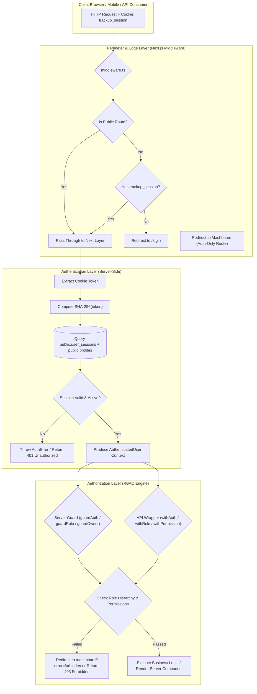
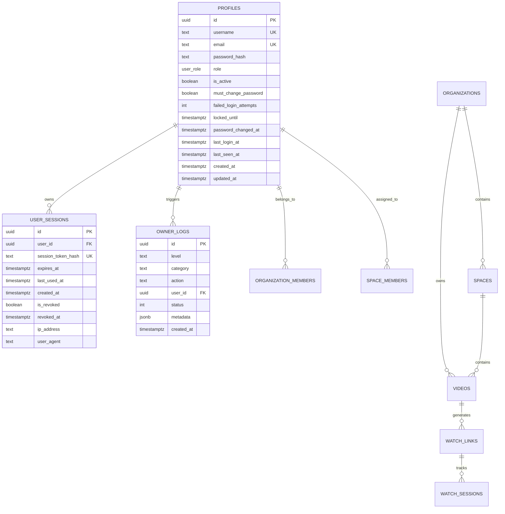
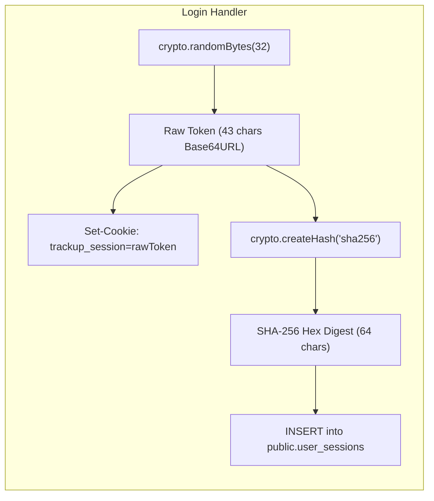
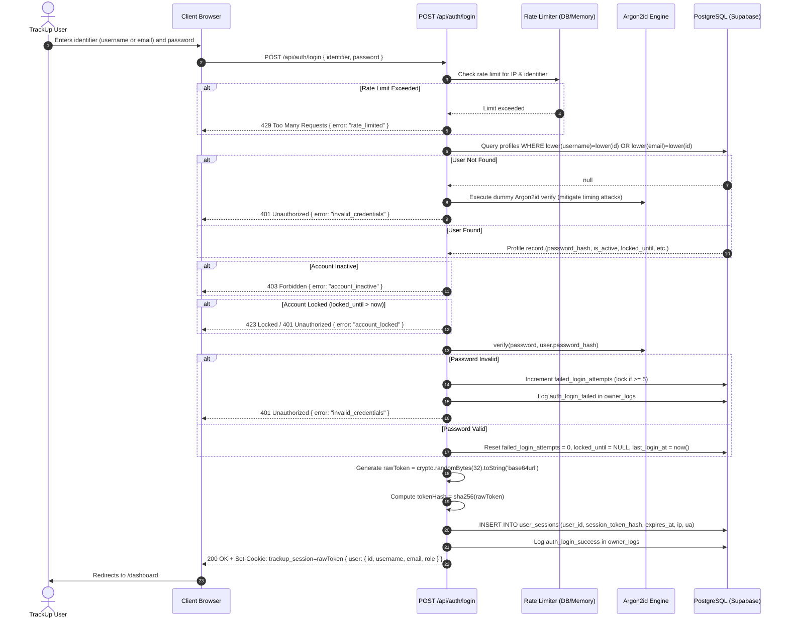
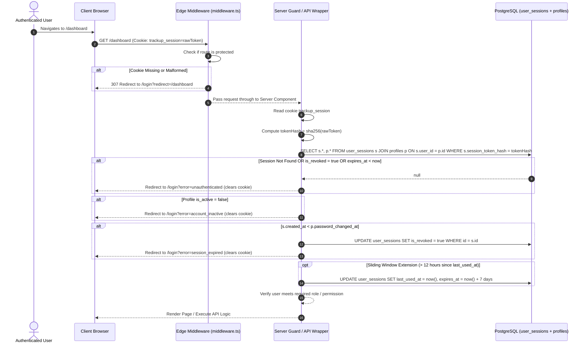
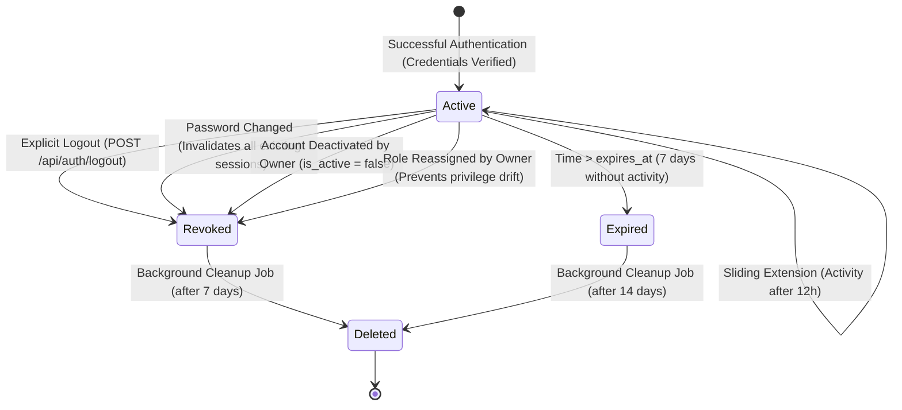
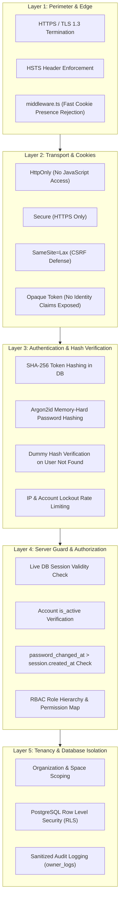

# TrackUp Custom Authentication Architecture & System Design

**Document Target:** `TRACKUP_CUSTOM_AUTH_DESIGN.md`  
**Execution Context:** Repository Root (`c:\Users\seift\Downloads\Phantoms\2nd\websites\traking`)  
**Status:** Architectural Specification & Engineering Blueprint (No production code modified in this phase)  
**Reference Document:** `TRACKUP_CUSTOM_AUTH_MIGRATION_AUDIT.md`  

---

## 1. Executive Summary & Architectural Vision

TrackUp is evolving from a ClickUp-dependent companion utility into a completely sovereign, self-contained video tracking and intelligence platform.

### Core Architectural Mandates
1. **Sovereign Identity Authority**: TrackUp owns its user registry completely. Users exist natively in TrackUp's PostgreSQL database (`public.profiles`) before any authentication attempt can occur.
2. **Zero Public Registration**: There is no self-registration, public sign-up endpoint, self-service onboarding, or social login. User creation is strictly restricted to authorized TrackUp `owner` accounts through a dedicated management control plane.
3. **User Record Model**:
   - `id`: UUID (Primary Key)
   - `username`: Case-insensitive unique identifier (3–30 characters, alphanumeric and underscore)
   - `email`: Normalized unique email address (RFC 5322)
   - `password_hash`: Cryptographically secure PHC-formatted Argon2id hash
   - `role`: Strict 3-tier enum (`owner`, `admin`, `viewer`)
   - `is_active`: Boolean status flag controlling account validity
   - `created_at`: Immutable UTC creation timestamp
   - `updated_at`: UTC modification timestamp (managed via trigger)
   - `last_login_at`: UTC timestamp of the most recent successful authentication
   - `password_changed_at`: UTC timestamp used to invalidate pre-existing sessions upon credential rotation
4. **Server-Side Session Model**:
   - Authentication transitions from stateless signed cookie payloads to stateful, database-backed server sessions (`public.user_sessions`).
   - The browser receives a cryptographically random, 256-bit entropy opaque session token stored in an `HttpOnly`, `Secure`, `SameSite=Lax` cookie.
   - The database stores **only** the cryptographic SHA-256 hash of the session token, protecting active sessions against credential compromise even if the database is leaked.
5. **Clean Separation of Concerns**:
   - **Authentication ("Who is this user?")**: Resolves the opaque cookie token into a verified, active user identity via the session database.
   - **Authorization ("What is this user allowed to do?")**: Enforces hierarchical role checks (`owner` > `admin` > `viewer`) and fine-grained capabilities (`ROLE_PERMISSIONS`) across Edge Middleware, Server Component Page Guards, and Route Handler API Wrappers.
6. **Total ClickUp Decoupling**: Complete removal of ClickUp OAuth endpoints, API client libraries, sync jobs, and ClickUp-specific database entities.

---

## 2. High-Level Architecture Diagram



---

## 3. Database Schema Specification

The database architecture is designed for PostgreSQL on Supabase. It expands `public.profiles` to store credentials and creates a dedicated `public.user_sessions` table for server-side session management.

### 3.1 Entity Relationship Diagram



### 3.2 SQL Migration: `public.profiles` Extension & `public.user_sessions`

```sql
-- ==============================================================================
-- TrackUp Custom Auth: Core Schema & Session Store
-- ==============================================================================

-- 1. Ensure user_role enum exists
DO $$ BEGIN
  CREATE TYPE public.user_role AS ENUM ('owner', 'admin', 'viewer');
EXCEPTION
  WHEN duplicate_object THEN null;
END $$;

-- 2. Expand public.profiles for Custom Authentication
ALTER TABLE public.profiles
  ADD COLUMN IF NOT EXISTS username TEXT,
  ADD COLUMN IF NOT EXISTS password_hash TEXT,
  ADD COLUMN IF NOT EXISTS must_change_password BOOLEAN NOT NULL DEFAULT false,
  ADD COLUMN IF NOT EXISTS failed_login_attempts INT NOT NULL DEFAULT 0,
  ADD COLUMN IF NOT EXISTS locked_until TIMESTAMPTZ NULL,
  ADD COLUMN IF NOT EXISTS password_changed_at TIMESTAMPTZ NOT NULL DEFAULT timezone('utc'::text, now()),
  ADD COLUMN IF NOT EXISTS last_login_at TIMESTAMPTZ NULL;

-- 3. Case-Insensitive Unique Indexes for Username and Email
CREATE UNIQUE INDEX IF NOT EXISTS idx_profiles_username_lower
  ON public.profiles (LOWER(username));

CREATE UNIQUE INDEX IF NOT EXISTS idx_profiles_email_lower
  ON public.profiles (LOWER(email));

-- 4. Create Server-Side Session Storage Table
CREATE TABLE IF NOT EXISTS public.user_sessions (
  id UUID PRIMARY KEY DEFAULT gen_random_uuid(),
  user_id UUID NOT NULL REFERENCES public.profiles(id) ON DELETE CASCADE,
  session_token_hash TEXT NOT NULL UNIQUE,
  expires_at TIMESTAMPTZ NOT NULL,
  last_used_at TIMESTAMPTZ NOT NULL DEFAULT timezone('utc'::text, now()),
  created_at TIMESTAMPTZ NOT NULL DEFAULT timezone('utc'::text, now()),
  is_revoked BOOLEAN NOT NULL DEFAULT false,
  revoked_at TIMESTAMPTZ NULL,
  ip_address TEXT NULL,
  user_agent TEXT NULL
);

-- 5. Session Query Performance Indexes
CREATE INDEX IF NOT EXISTS idx_user_sessions_lookup
  ON public.user_sessions(session_token_hash)
  WHERE is_revoked = false;

CREATE INDEX IF NOT EXISTS idx_user_sessions_user_id
  ON public.user_sessions(user_id);

CREATE INDEX IF NOT EXISTS idx_user_sessions_active_expiry
  ON public.user_sessions(expires_at)
  WHERE is_revoked = false;

-- 6. Rate Limiting Storage Table (for distributed/serverless brute-force protection)
CREATE TABLE IF NOT EXISTS public.auth_rate_limits (
  key TEXT PRIMARY KEY,
  attempts INT NOT NULL DEFAULT 1,
  first_attempt_at TIMESTAMPTZ NOT NULL DEFAULT timezone('utc'::text, now()),
  expires_at TIMESTAMPTZ NOT NULL
);

CREATE INDEX IF NOT EXISTS idx_auth_rate_limits_expiry
  ON public.auth_rate_limits(expires_at);

-- 7. Row Level Security on user_sessions
ALTER TABLE public.user_sessions ENABLE ROW LEVEL SECURITY;

-- Block all direct authenticated/anon access; only service-role can query/write sessions
DROP POLICY IF EXISTS "No direct client access to user_sessions" ON public.user_sessions;
CREATE POLICY "No direct client access to user_sessions"
  ON public.user_sessions
  FOR ALL
  TO authenticated, anon
  USING (false)
  WITH CHECK (false);

-- 8. Periodic Session Cleanup Helper Function
CREATE OR REPLACE FUNCTION public.cleanup_expired_user_sessions()
RETURNS INT AS $$
DECLARE
  deleted_count INT;
BEGIN
  DELETE FROM public.user_sessions
  WHERE expires_at < (timezone('utc'::text, now()) - interval '14 days')
     OR (is_revoked = true AND revoked_at < (timezone('utc'::text, now()) - interval '7 days'));
  GET DIAGNOSTICS deleted_count = ROW_COUNT;
  RETURN deleted_count;
END;
$$ LANGUAGE plpgsql SECURITY DEFINER SET search_path = public;
```

---

## 4. Cryptographic Specifications & Password Engine

### 4.1 Password Hashing: Argon2id Specification

To satisfy the requirement of modern, server-side password authentication resistant to GPU and ASIC attacks:
- **Algorithm**: Argon2id (RFC 9106)
- **Engine Library**: `@node-rs/argon2`
  - High-performance, cross-platform precompiled native binary via napi-rs.
  - Zero Python or C++ compiler build requirements during `npm install`.
  - Fully compatible with Windows x64, Linux (Vercel/Docker), and macOS.
- **OWASP Recommended Parameters**:
  - Memory cost (`m`): `65536` KB (64 MB)
  - Time cost / Iterations (`t`): `3`
  - Parallelism (`p`): `4` threads
  - Output hash length: `32` bytes
  - Salt length: `16` cryptographically random bytes (`crypto.randomBytes(16)`)
- **PHC Format Output**:
  ```text
  $argon2id$v=19$m=65536,t=3,p=4$<salt>$<hash>
  ```
- **Fallback Adapter**: In environments where native modules cannot load, a pure Node.js `node:crypto.scrypt` engine (`N=16384, r=8, p=1, keylen=64`) is provided via an interchangeable `PasswordProvider` interface.

### 4.2 Password Validation Policy
- Minimum length: **10 characters**
- Maximum length: **128 characters** (mitigates DoS via oversized hashing inputs)
- Complexity criteria:
  - At least 1 uppercase letter (`[A-Z]`)
  - At least 1 lowercase letter (`[a-z]`)
  - At least 1 number (`[0-9]`)
  - At least 1 symbol/special character (`[!@#$%^&*()_+\-=\[\]{};':"\\|,.<>\/?]`)
- Contextual exclusions:
  - Cannot match or contain the user's `username` (case-insensitive)
  - Cannot match or contain the user's `email` local-part

---

## 5. Session Architecture & Cookie Security

### 5.1 Token Generation & Hashing


1. **Token Generation**:
   `rawToken = crypto.randomBytes(32).toString('base64url')` (256 bits of cryptographic entropy).
2. **Token Storage in Cookie**:
   The browser receives **only** the `rawToken`.
3. **Database Storage**:
   The database stores **only** `session_token_hash = sha256(rawToken)`.
4. **Token Verification**:
   When the cookie arrives, the server hashes it (`sha256(cookieValue)`) and performs an index lookup in `public.user_sessions`.

### 5.2 Session Cookie Configuration
The session cookie must strictly adhere to the following security attributes:
```typescript
export const SESSION_COOKIE_NAME = "trackup_session";
export const SESSION_MAX_AGE_SECONDS = 60 * 60 * 24 * 7; // 7 days

export function getSessionCookieOptions(): CookieOptions {
  const isProduction = process.env.NODE_ENV === "production";
  return {
    name: SESSION_COOKIE_NAME,
    httpOnly: true,
    secure: isProduction,
    sameSite: "lax",
    path: "/",
    maxAge: SESSION_MAX_AGE_SECONDS,
    expires: new Date(Date.now() + SESSION_MAX_AGE_SECONDS * 1000),
  };
}
```

- **`httpOnly: true`**: JavaScript cannot access `document.cookie`, preventing session hijacking via Cross-Site Scripting (XSS).
- **`secure: true` (in production)**: Cookie is transmitted exclusively over TLS/HTTPS connections.
- **`sameSite: "lax"`**: Protects against Cross-Site Request Forgery (CSRF) on mutation requests while allowing top-level link navigations.
- **`path: "/"`**: Guarantees the session cookie is transmitted to all application routes and API endpoints.
- **Explicit `expires` & `maxAge`**: Ensures browser and server clocks remain aligned on session expiration.

---

## 6. Detailed Request Lifecycle & Sequence Diagrams

### 6.1 Login Flow Sequence



### 6.2 Session Validation & Request Authentication Sequence



### 6.3 Logout Sequence

```mermaid
sequenceDiagram
    autonumber
    actor User as User
    participant Browser as Client Browser
    participant API as POST /api/auth/logout
    participant DB as PostgreSQL (user_sessions + owner_logs)

    User->>Browser: Clicks "Sign Out"
    Browser->>API: POST /api/auth/logout (Cookie: trackup_session)
    API->>API: Hash rawToken from cookie
    API->>DB: UPDATE user_sessions SET is_revoked = true, revoked_at = now() WHERE session_token_hash = hash
    API->>DB: Log auth_logout in owner_logs
    API-->>Browser: 200 OK + Set-Cookie: trackup_session=; Max-Age=0; Path=/
    Browser->>Browser: Clear session from memory
    Browser->>User: Redirect to /login
```

---

## 7. Session Lifecycle Management

### 7.1 Session State Machine



### 7.2 Session Revocation Scenarios
1. **User Logout**: Revokes the specific calling session (`is_revoked = true`).
2. **Password Change**: Automatically revokes **all** active sessions for the user (`UPDATE user_sessions SET is_revoked = true WHERE user_id = $1`).
3. **Owner Account Deactivation**: When an owner toggles a user to `is_active = false`, all sessions for that `user_id` are revoked immediately.
4. **Owner Role Demotion**: When a user's role is changed (e.g. `admin` to `viewer`), all active sessions for that user are revoked, forcing re-authentication to guarantee no elevated access persists.

---

## 8. Password Management & Lifecycle

### 8.1 User Provisioning (Owner-Only)
Since public registration is completely disabled, new accounts are created solely by authenticated users holding the `owner` role.
- **Endpoint**: `POST /api/owner/users`
- **Payload**:
  ```json
  {
    "username": "johndoe",
    "email": "john.doe@company.com",
    "password": "SecurePassword123!",
    "role": "admin" | "viewer"
  }
  ```
- **Validation**:
  1. Caller must have `user.role === 'owner'` (enforced via `withRole(USER_ROLES.OWNER)`).
  2. Input validation: `username` must match `^[a-zA-Z0-9_]{3,30}$`.
  3. `email` must be valid RFC 5322 email.
  4. Check uniqueness of `LOWER(username)` and `LOWER(email)` in `public.profiles`.
  5. Validate `password` against the complexity policy.
  6. Compute Argon2id hash of password.
  7. Insert profile with `role`, `is_active = true`, `must_change_password = true`.
  8. Automatically associate profile with primary Organization and Default Space.
  9. Log `auth_user_created` in `owner_logs`.

### 8.2 Self-Service Password Change
- **Endpoint**: `POST /api/auth/change-password`
- **Preconditions**: User must have an active session (`withAuth`).
- **Payload**: `{ currentPassword, newPassword }`
- **Execution**:
  1. Retrieve caller profile from database.
  2. Verify `currentPassword` against `profiles.password_hash`.
  3. Validate `newPassword` against complexity policy.
  4. Verify `newPassword !== currentPassword`.
  5. Hash `newPassword` with Argon2id.
  6. Transaction:
     - Update `profiles.password_hash = newHash, password_changed_at = now(), must_change_password = false`.
     - Revoke all other active sessions for this user (`UPDATE user_sessions SET is_revoked = true WHERE user_id = $1 AND id != currentSessionId`).
  7. Log `auth_password_changed` in `owner_logs`.

### 8.3 Owner-Initiated Password Reset
- **Design Decision**: To eliminate account enumeration vectors and unwanted exposure, there is **no public "Forgot Password" form**.
- If a user loses credentials, they contact their TrackUp Owner.
- **Endpoint**: `POST /api/owner/users/[id]/reset-password`
- **Payload**: `{ temporaryPassword }`
- **Execution**:
  1. Enforces `isOwner(caller.role)`.
  2. Validates `temporaryPassword` against complexity policy.
  3. Updates target user: `password_hash = newHash, must_change_password = true, password_changed_at = now(), failed_login_attempts = 0, locked_until = NULL`.
  4. Revokes all active sessions for the target user.
  5. Logs `auth_user_password_reset_by_owner` in `owner_logs`.

---

## 9. Defense-in-Depth & Security Model



### 9.1 Brute-Force & Credential Stuffing Countermeasures
1. **IP-Level Rate Limiting**:
   - Up to 10 failed login attempts per client IP within a rolling 15-minute window.
   - Subsequent attempts receive `429 Too Many Requests`.
2. **Account Lockout**:
   - Up to 5 consecutive failed login attempts for any specific username or email.
   - Upon the 5th failed attempt, the profile's `locked_until` is set to `now() + 15 minutes`.
   - Any login attempt during lockout is rejected immediately.
3. **Constant-Time Verification Against Timing Attacks**:
   - If a requested `identifier` does not exist in `public.profiles`, the login handler hashes the supplied password against a pre-computed dummy Argon2id hash.
   - Both existing and non-existing user authentication paths take identical CPU execution time (~50–80ms), preventing username enumeration through timing analysis.

### 9.2 CSRF Mitigation Strategy
1. **`SameSite=Lax` Cookie Policy**:
   - Cross-site POST/PUT/DELETE requests initiated from third-party origins do not transmit the `trackup_session` cookie.
2. **Origin & Referer Validation**:
   - All state-mutating API routes (`POST`, `PUT`, `PATCH`, `DELETE`) verify that the incoming `Origin` or `Referer` header matches the application's trusted domain (`APP_URL` / `request.nextUrl.origin`).
3. **JSON Content-Type Requirement**:
   - All mutation endpoints enforce `Content-Type: application/json`. Standard cross-site HTML forms cannot submit application/json payloads without triggering a CORS preflight check.

---

## 10. Multi-Layer Guard & RBAC Architecture

### 10.1 Layer 1: Edge Middleware Strategy (`middleware.ts`)
The Edge Middleware operates as an ultra-fast perimeter filter. It performs zero database queries to ensure maximum Edge performance, checking cookie presence and basic routing rules.

```typescript
// Pseudocode Logic for middleware.ts
export async function middleware(request: NextRequest) {
  const { pathname } = request.nextUrl;
  const sessionCookie = request.cookies.get("trackup_session")?.value;
  const hasSession = Boolean(sessionCookie && sessionCookie.length >= 32);

  // 1. Allow public routes (tracking endpoints, public watch pages, static assets)
  if (isPublicPath(pathname)) return NextResponse.next();

  // 2. Auth-only routes (/login): if already logged in, redirect to dashboard
  if (isAuthOnlyPath(pathname)) {
    if (hasSession) {
      return NextResponse.redirect(new URL("/dashboard", request.url));
    }
    return NextResponse.next();
  }

  // 3. Protected routes (/dashboard, /videos, /analytics, /admin, /owner)
  if (isProtectedPath(pathname)) {
    if (!hasSession) {
      const loginUrl = new URL("/login", request.url);
      loginUrl.searchParams.set("redirect", pathname);
      return NextResponse.redirect(loginUrl);
    }
  }

  return NextResponse.next();
}
```

### 10.2 Layer 2: Server Component Page Guards (`src/lib/auth/guards.ts`)
Server Components execute on the Node.js server. They invoke database-backed guards that resolve the session token, query `user_sessions`, join with `profiles`, verify active status, and enforce RBAC:

```typescript
// Core page guards
export async function guardAuth(): Promise<AuthenticatedUser> {
  return await requireAuth(); // throws AuthError or redirects to /login
}

export async function guardRole(minimumRole: UserRole): Promise<AuthenticatedUser> {
  return await requireRole(minimumRole); // redirects to /dashboard?error=forbidden
}

export async function guardAdmin(): Promise<AuthenticatedUser> {
  return guardRole(USER_ROLES.ADMIN);
}

export async function guardOwner(): Promise<AuthenticatedUser> {
  return guardRole(USER_ROLES.OWNER);
}
```

### 10.3 Layer 3: API Route Handler Guards (`src/lib/auth/api-handler.ts`)
All internal API Route Handlers are wrapped with server-side authorization decorators:
- `withAuth(handler)`: Enforces valid active session; returns 401 if unauthenticated.
- `withRole(minimumRole, handler)`: Enforces role hierarchy; returns 403 if forbidden.
- `withPermission(permission, handler)`: Enforces specific `ROLE_PERMISSIONS` capability.
- `withDashboardAuth(handler)`: Enforces `admin` or `owner` role for internal dashboard operations.

### 10.4 RBAC Semantics Preservation
The existing TrackUp RBAC hierarchy and permission mappings remain 100% intact:
```typescript
export const ROLE_HIERARCHY: Record<UserRole, number> = {
  owner: 3,
  admin: 2,
  viewer: 1,
} as const;

export const ROLE_PERMISSIONS: Record<UserRole, ReadonlySet<Permission>> = {
  owner: new Set<Permission>([
    PERMISSIONS.USERS_READ,
    PERMISSIONS.USERS_MANAGE,
    PERMISSIONS.VIDEOS_READ,
    PERMISSIONS.VIDEOS_CREATE,
    PERMISSIONS.VIDEOS_UPDATE,
    PERMISSIONS.VIDEOS_DELETE,
    PERMISSIONS.ANALYTICS_READ,
    PERMISSIONS.ADMINS_MANAGE,
    PERMISSIONS.SETTINGS_MANAGE,
    PERMISSIONS.SYSTEM_MANAGE,
  ]),
  admin: new Set<Permission>([
    PERMISSIONS.VIDEOS_READ,
    PERMISSIONS.VIDEOS_CREATE,
    PERMISSIONS.VIDEOS_UPDATE,
    PERMISSIONS.VIDEOS_DELETE,
    PERMISSIONS.ANALYTICS_READ,
  ]),
  viewer: new Set<Permission>([
    PERMISSIONS.VIDEOS_READ,
    PERMISSIONS.ANALYTICS_READ,
  ]),
};
```

---

## 11. Owner User-Management Flow & UI Design

### 11.1 Control Plane Capabilities
The Owner manages user accounts via `/admin/users` (which is strictly protected by `guardOwner()`):
1. **User Directory**:
   - Displays all users: Username, Email, Role badge, Active/Inactive status, Last Login timestamp, Created date.
   - Filter by Role (`all`, `owner`, `admin`, `viewer`) and Status (`all`, `active`, `inactive`).
   - Search by username or email.
2. **Create New User**:
   - Modal dialog: Username, Email, Initial Password, Role selection (`admin` or `viewer`).
   - Automatically provisions profile, assigns default organization/space, and logs event.
3. **Toggle Active Status**:
   - Instantly activate/deactivate an account. Deactivation immediately invalidates all active sessions for that user.
   - Owner account is strictly protected from self-deactivation.
4. **Role Modification**:
   - Promote `viewer` to `admin` or demote `admin` to `viewer`.
   - Changing a user's role revokes their current active sessions to prevent privilege drift.
5. **Reset Password**:
   - Sets a temporary password and flags `must_change_password = true`.

---

## 12. Audit Logging & Observability

Every security-sensitive operation writes a sanitized, structured record to `public.owner_logs` via `src/lib/observability/logger.ts`:

| Event Action | Category | Severity | Captured Metadata |
| :--- | :--- | :--- | :--- |
| `auth_login_success` | `AUTH` | `INFO` | `{ user_id, ip, user_agent }` |
| `auth_login_failed` | `AUTH` | `WARN` | `{ identifier, reason, ip, user_agent }` |
| `auth_account_locked` | `AUTH` | `WARN` | `{ identifier, locked_until, ip }` |
| `auth_logout` | `AUTH` | `INFO` | `{ user_id, session_id }` |
| `auth_password_changed` | `AUTH` | `INFO` | `{ user_id }` |
| `auth_user_created` | `AUTH` | `INFO` | `{ owner_id, new_user_id, username, role }` |
| `auth_user_status_changed`| `AUTH` | `INFO` | `{ owner_id, target_user_id, is_active }` |
| `auth_user_role_changed`  | `AUTH` | `INFO` | `{ owner_id, target_user_id, old_role, new_role }` |
| `auth_session_revoked`    | `AUTH` | `INFO` | `{ user_id, session_id, reason }` |

*Security Rule*: `logger.ts` automatically redacts passwords, tokens, cookies, and secret keys via `SECRET_KEY_PATTERN`.

---

## 13. Zero-Downtime Migration Strategy

The migration from ClickUp OAuth to Custom Auth executes in four safe, non-breaking stages:

```mermaid
flowchart TD
    subgraph Stage1["Stage 1: Schema Expansion & Initial Seeding"]
        s1a["Deploy migration: user_sessions table + profiles credentials columns"]
        s1b["Backfill username for existing profiles from email local-part"]
        s1c["Bootstrap initial Owner account with password_hash"]
        s1d["Add organization_id to public.videos & backfill from spaces"]
    end

    subgraph Stage2["Stage 2: Core Auth Engine & APIs"]
        s2a["Implement @node-rs/argon2 password engine"]
        s2b["Implement server-side session utilities (session.ts)"]
        s2c["Deploy POST /api/auth/login and POST /api/auth/logout"]
        s2d["Deploy Owner user creation endpoints (/api/owner/users)"]
    end

    subgraph Stage3["Stage 3: UI Transformation & Guards"]
        s3a["Update /login page to username/password form"]
        s3b["Update /admin/users to Owner User Management UI"]
        s3c["Update middleware.ts to inspect trackup_session"]
        s3d["Update guards.ts to validate database sessions"]
    end

    subgraph Stage4["Stage 4: ClickUp Purge & Decoupling"]
        s4a["Delete ClickUp OAuth routes (/api/auth/clickup/*)"]
        s4b["Delete ClickUp sync & task routes (/api/clickup/*)"]
        s4c["Delete src/lib/clickup client modules"]
        s4d["Drop clickup_connections & video_clickup_tasks tables"]
        s4e["Remove ClickUp environment variables from .env"]
    end

    Stage1 --> Stage2
    Stage2 --> Stage3
    Stage3 --> Stage4
```



---

## 14. Exact Inventory of Codebase Changes

### 14.1 Files Expected to CHANGE (Refactor / Modify)

| File Path | Nature of Changes |
| :--- | :--- |
| `middleware.ts` | Replace `trackup_user` HMAC parsing with `trackup_session` cookie verification and route redirection. |
| `src/types/auth.ts` | Expand `Profile` interface with `username`, `must_change_password`, `last_login_at`. Remove ClickUp references. |
| `src/lib/auth/session.ts` | Rewrite `getCurrentUser` and `requireAuth` to look up sessions in `public.user_sessions` by SHA-256 token hash. |
| `src/lib/auth/guards.ts` | Update page guards to validate database sessions and redirect unauthenticated users to `/login`. |
| `src/lib/auth/api-handler.ts`| Ensure route wrappers log authentication events and return consistent 401/403 responses. |
| `src/lib/auth/rbac.ts` | Remove ClickUp OAuth owner sniffing; maintain roles, hierarchy, and permissions. |
| `app/(auth)/login/page.tsx` | Replace ClickUp OAuth redirect logic with TrackUp credentials login form. |
| `src/components/login/LoginCard.tsx` | Replace ClickUp logo, OAuth button, and copy with username/password login inputs. |
| `src/components/login/LoginHero.tsx` | Update hero copy and remove ClickUp integration references. |
| `src/components/login/login-content.ts` | Replace ClickUp setup steps with TrackUp product feature highlights. |
| `src/components/navigation/ResponsiveNav.tsx` | Update navigation links, login CTA, and remove ClickUp references. |
| `app/admin/users/page.tsx` | Update page shell to connect to native TrackUp user management without ClickUp workspace checks. |
| `src/components/dashboard/TeamMemberManager.tsx` | Refactor from email invitations to direct Owner User Creation (`username`, `email`, `password`, `role`). |
| `src/lib/spaces/access.ts` | Decouple mutation scopes from ClickUp workspace IDs; use `organization_id`. |
| `src/lib/spaces/data-scope.ts` | Remove ClickUp workspace tenancy fallbacks. |
| `src/lib/videos/service.ts` | Remove `workspace_id` requirement; query videos by `organization_id` and `space_id`. |
| `package.json` | Add `@node-rs/argon2` dependency. |
| `scripts/verify-provisioning.ts` | Rewrite tests to verify credentials auth and owner user provisioning. |
| `scripts/verify-routes.ts` | Update route assertions to remove `/api/auth/clickup/*`. |
| `scripts/verify-security-hardening.ts`| Test session token hashing, brute-force lockout, and rate limiting. |

### 14.2 Files Expected to be CREATED

| File Path | Purpose |
| :--- | :--- |
| `supabase/migrations/20261001000001_trackup_custom_auth.sql` | Migration adding `user_sessions`, rate limit tables, `username`, and `password_hash`. |
| `src/lib/auth/password.ts` | Argon2id password hashing and verification module with OWASP parameters. |
| `src/lib/auth/session-token.ts` | Cryptographic random token generator and SHA-256 session hasher. |
| `src/lib/auth/rate-limiter.ts` | Brute-force protection and IP/identifier rate limiting engine. |
| `app/api/auth/login/route.ts` | Sovereign credential login endpoint minting `trackup_session`. |
| `app/api/auth/logout/route.ts` | Sovereign session revocation endpoint clearing `trackup_session`. |
| `app/api/auth/change-password/route.ts`| Self-service password change endpoint for authenticated users. |
| `app/api/owner/users/route.ts` | Owner-only endpoint to create new users and list existing users. |
| `app/api/owner/users/[id]/reset-password/route.ts` | Owner-only endpoint to reset a user's password. |
| `src/components/login/LoginForm.tsx` | Interactive client component for credential login (username/password, show/hide password). |
| `src/components/dashboard/CreateUserModal.tsx` | Owner modal for creating users with role assignment. |
| `scripts/seed-owner.ts` | CLI bootstrap script to create the initial TrackUp Owner account. |

### 14.3 Files Expected to be DELETED

| File Path | Rationale for Deletion |
| :--- | :--- |
| `app/api/auth/clickup/route.ts` | Obsolete ClickUp OAuth initiation endpoint. |
| `app/api/auth/clickup/callback/route.ts` | Obsolete ClickUp OAuth token exchange and provisioning endpoint. |
| `app/api/clickup/sync/route.ts` | Obsolete ClickUp background sync route. |
| `app/api/clickup/tasks/route.ts` | Obsolete ClickUp task creation route. |
| `app/api/clickup/tasks/[id]/route.ts` | Obsolete ClickUp task management route. |
| `app/api/admin/invitations/[id]/resend/route.ts` | Obsolete ClickUp-based invitation resend endpoint. |
| `app/api/admin/invitations/[id]/route.ts` | Obsolete ClickUp-based invitation revocation endpoint. |
| `src/lib/clickup/client.ts` | Obsolete ClickUp HTTP API client. |
| `src/lib/clickup/auth.ts` | Obsolete ClickUp token management utility. |
| `src/lib/clickup/sync.ts` | Obsolete ClickUp workspace sync engine. |
| `src/lib/clickup/workspace.ts` | Obsolete ClickUp workspace mapper. |
| `src/lib/clickup/types.ts` | Obsolete ClickUp API TypeScript definitions. |
| `src/components/login/ClickUpLogo.tsx` | Obsolete third-party brand asset. |
| `scripts/forensic-oauth-callback.ts` | Obsolete test script testing ClickUp OAuth callback logic. |

---

## 15. Explicit Definition of Done

The Custom Authentication implementation will be deemed complete and verified when:
1. **Schema Integrity**:
   - `public.user_sessions` and `public.auth_rate_limits` tables exist with complete indexes and RLS.
   - `public.profiles` contains `username`, `password_hash`, `is_active`, `locked_until`, `last_login_at`.
   - `public.videos` contains `organization_id` and functions without `workspace_id`.
2. **Authentication Independence**:
   - A seeded or owner-provisioned user can log in with username/email + password via `/login` and `/api/auth/login`.
   - Authentication succeeds with zero calls to ClickUp or any external OAuth provider.
   - The browser receives an `HttpOnly`, `Secure`, `SameSite=Lax` cookie `trackup_session`.
   - The database stores only the SHA-256 hash of the session token.
3. **Owner-Only Provisioning**:
   - Public registration does not exist.
   - Only a user with role `owner` can call `POST /api/owner/users` to create a new user.
   - Attempts by `admin`, `viewer`, or anonymous users to create users return `403 Forbidden` or `401 Unauthorized`.
4. **RBAC & Authorization Preservation**:
   - Existing roles (`owner`, `admin`, `viewer`) enforce the exact permission matrix defined in `ROLE_PERMISSIONS`.
   - Deactivated users (`is_active = false`) are immediately rejected by Server Guards and API wrappers.
5. **Security & Session Lifecycle**:
   - Logout (`POST /api/auth/logout`) marks the session revoked in the database and clears the browser cookie.
   - Consecutive failed logins trigger account lockout and rate limiting.
   - Password changes revoke all pre-existing sessions for that user.
6. **Codebase Cleanliness & Tests**:
   - All ClickUp routes, clients, logos, and dependencies are deleted.
   - `cmd /c npm run typecheck` passes with 0 errors.
   - `cmd /c npm run lint` passes with 0 errors.
   - `cmd /c npm test` passes all verification test suites.
